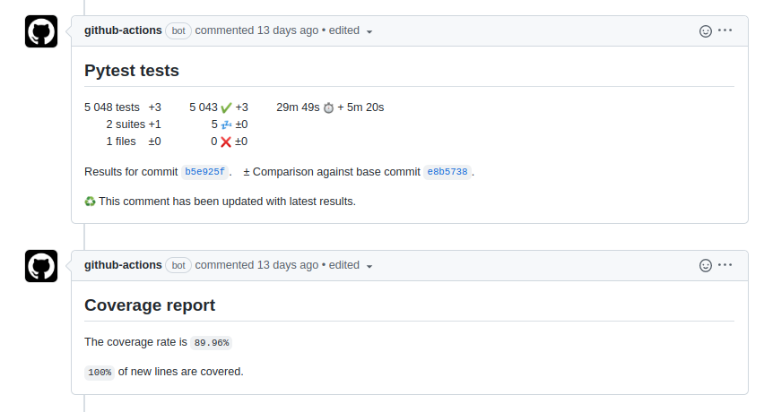

# Parallel CI agnostic python testing in Github Actions

## Prerequisites and recomendations

* Docker and docker-compose usage, recommending [Docker Deep Dive by Nigel Pulton](https://www.oreilly.com/library/view/docker-deep-dive/9781800565135/) to get necessary level
* Python at scripting level, recommending [Python in simple packages by Lubanovic](https://www.amazon.com/Introducing-Python-Modern-Computing-Packages/dp/1492051365)
* Python paralellism stuff, recommending `Chapter 6: Concurrency` out of [Expert Python programming by Jaworski](https://www.amazon.com/Expert-Python-Programming-practices-programming/dp/1801071101)
* Knowing what for testing is needed, recommending [Unit testing principles, practices and patterns by Khorikov](https://www.amazon.com/Unit-Testing-Principles-Practices-Patterns/dp/1617296279)
* Knowing what for CI tools like Github Actions or Gitlab CI are needed

## Problem:

we have around 5000 unit and integration tests in a Django backend API project, which we test with pytest. They take half an hour to finish themselves locally or in Github Actions (GA) CI. As result, they produce coverage.xml and junit.xml exported into GA plugins to visualize results with better GUI. We wish to run them faster.

## Introduction to environment

We are using docker-compose like below to raise a dev environment

```yaml
version: '3.8'
services:
  db:
    image: postgres:13
    environment:
      POSTGRES_HOST_AUTH_METHOD: trust
      POSTGRES_DB: default
      POSTGRES_USER: postgres
      POSTGRES_PASSWORD: postgres
    expose:
      - "5432"

  redis:
    image: redis
    expose:
      - "6379"

  app:
    links:
      - db
      - redis
    build: .
```

All of our tests are run pretty much with the command below in Github Actions:

```bash
docker-compose run -v $(pwd):/code -u 0 app pytest --cov=. --junit-xml=unit.xml .
```

The main advantages of this approach

- in having the same tests runnable locally,
- same sidecar dependencies raised in CI, same test environment in local dev env and CI environment ran.
- The code for this CI test run is easily transferable to any other CI tool.

As disadvantages:

- people need to ensure for CI runner to have `docker-compose` available inside CI job, with docker daemon provided.
- potentially sidecar containers can be not fast enough to raise themselves. In this case, you would wish to apply a tool like [wait_for_it.sh](https://github.com/vishnubob/wait-for-it), which without any other dependencies will wait the necessary time for dependency to become available (`wait_for_it.sh db:5432 -t 60 && wait_for_it.sh redis:5379 -t 60 && pytest` in our case for example)

**Important note**

As artifacts of a test run, we produce `unit.xml`, and `coverage.xml` files, to ensure having published passed tests into Github Actions graphical interface, and coverage results. It allows faster seeing logs to specific broken tests without digging through raw log output and seeing testing coverage metrics changes.

```yaml
      - name: Publish Unit Test Results
        uses: EnricoMi/publish-unit-test-result-action@v1
        if: always()
        continue-on-error: true
        with:
          files: unit.xml
          check_name: Pytest tests
      - name: Display coverage
        if: always()
        continue-on-error: true
        uses: ewjoachim/coverage-comment-action@v1
        with:
          GITHUB_TOKEN: ${{ github.token }}
          COVERAGE_FILE: coverage.xml
```



## Task definition

Usually, people assume to use [pytest-xdist](https://pypi.org/project/pytest-xdist/) in the Python ecosystem in order to have tests runnable in parallel. I was offered to collect flappy tests data in [datadog](https://www.datadoghq.com/), and after having them analyzed to fix them so that nothing would prevent their running in pytest-xdist. We needed to run our tests faster :)

## Analysis

First, we collected broken tests wrongly working Django translation, which is dependent on Linux Gettext. According to [found information](https://www.gnu.org/software/gettext/manual/gettext.html) - gettext is not really thread-safe:

> The GNU Gettext runtime supports only one locale per process. It is not thread-safe to use multiple locales and encodings in the same process. This is perfectly fine for applications that interact directly with a single user like most GUI applications, but is problematic for services and servers.

After having found an interesting source of information [at this page](https://stackoverflow.com/questions/45733763/pytest-run-tests-parallel), we can assume that the default method to run pytest looks like using multithreading, but multiprocessing is clearly possible as well. (See code below). It can fix part of the test problems at least.

```bash
pip install pytest-xdist

# The most primitive case, sending tests to multiple CPUs:
pytest -n NUM

# Execute tests within 3 subprocesses.
pytest --dist=each --tx 3*popen//python=python3.6

# Execute tests in 3 forked subprocess. Won't work on windows.
pytest --dist=each --tx 3*popen//python=python3.6 --boxed

# Sending tests to the ssh slaves
pytest --dist=each --tx ssh=first_slave --tx ssh=seconds_slave --rsyncdir package package

# Sending tests to the socket server, link is available below.
python socketserver.py :8889 &
python socketserver.py :8890 &
pytest --dist=each --tx socket=localhost:8889 --tx socket=localhost:8890
```

Further collecting data from datadog, there were tests broken because tests used same cache storage in shared `redis`
Other tests became broken because of an asserted count of SQL requests made by ORM in one of the tests. It made more than necessary because another process was running query to db at the same time. Which allowed concluding that having a shared sidecar container `db`, made tests broken just because they use the same db instance.

I received recommendations to fix caching by using in-memory solution, but it became obvious to me, that we would be encountering one or other new reasons why tests are broken again and again.

It allows us to make next conclusion, that if we are using pytest-xdist:

- It is additional development cost to fix all current parallel problems in tests, and it will increase development cost in a future to keep it that way
- we would be decreasing how good our test environment is, with replacing side car container like Redis with in memory alternatives, which will decrease quality of tests.

## Solution

Instead of using pytest-xdist... I realized just to split pytest tests into groups. Luckily there is even a library for this - [pytest-split](https://pypi.org/project/pytest-split/). Each group of tests we will be running in its own raised docker-compose group of containers, each process would be having its own db instance, redis instance and whatever else side car dependency needed. Thus, it would be a perfect imitation for tests being run still in sequence instead of being run in parallel :) The only little problem we need to solve after that, with having merged coverage and junit output results for our Github Actions GUI.

Since we are in Python, the solution is implemented in python as well, with the help of `subprocess` library for multiprocessing and `argparse` library to have better self documented interface.

##### 1. Github Actions Self hosted runner

Firstly we raise self-hosted Github Actions runner with available docker-compose inside. Since Github Actions installing documentation is offering only installation to Linux manually and clearly lacking in this regard in comparison to Gitlab CI which offers its runnes installations ready solutions for docker and even kubernetes, we write our own solution to automate default Github Actions installation through `pyexpect` library, and thus having it containerized as well. Command to quickly raise GA runner becomes `TOKEN=your_github_token_to_register_runner docker-compose up`. See full code in [repository](https://github.com/darklab8/darklab_github_ci) for reference.

* [Installing docker for example at ubuntu](https://docs.docker.com/engine/install/ubuntu/)
* [Installing docker-compose](https://www.digitalocean.com/community/tutorials/how-to-install-and-use-docker-compose-on-ubuntu-20-04)
* `git clone https://github.com/darklab8/darklab_github_ci.git`
* `TOKEN=your_github_token_to_register_runner docker-compose up -d` # in order to launch
* check with `docker-compose logs` to check for being succesful
  ```
  app_1   | python3: running listener
  app_1   | 
  app_1   | √ Connected to GitHub
  app_1   | 
  app_1   | Current runner version: '2.294.0'
  app_1   | 2022-09-16 21:39:58Z: Listening for Jobs
  ```

##### 2. Triggering CI

As latest step, we need to invoke our pipeline:

* Just pushing any code to master branch of our repository with installed parallel_pytest or opening pull request to merge commits to master, or requesting new workflow at Actions interface :) You see full code of [a solution here](https://github.com/darklab8/darklab_article_parallel_pytest)

under the hood it does:

```
checking out code if repository in CI run

building if necessary image and assigning it tag name

opening multiple sub processes and each runs its own docker-compose with unique -p project_name in order to avoid container reusage.
results are outputed as reports/junit_{number of process}.xml and reports/.coverage_{number of process}.xml

we run script to merge multiple coverage results and junit results into single files

publishing results into Github GUI
```

##### Debugging tips

python3 -m make parallel_pytest --dry # can help you to run commands only without running them
or just run tests with less amount of selected tests.

## Conclusion

* Our tests are now runnable in parallel and we can enjoy having them run faster:

  * 1 Core = 24 minutes 40 secs (no parallelism)
  * 2 core = 15 minutes 31 secs
  * 6 core = 8 minutes (pc with intel i5-10400 6 core/12threaded processor)
* We haven't changed anything of a working code to make it more multithreading/multiprocessing safer. We solved the issue at a level above it. We don't need to keep in the future our code any safer than it is already.
* We kept code running with sidecar containers with postgresql, redis or anything else that is needed, thus having less difference between dev and prod. Thus keeping following rule 10th rule of [The Twelve-Factor app](https://12factor.net/)
* We received a solution universal enough to be reapplied to any other repository needing to be sped up
* We kept our paradigm of being CI agnostic and can run our solution easily locally.

## Future possible steps

* Refactoring code to be more universal to become third party library reusable for any other repo
* Making parallel_pytest script available as compiled binary in golang? In order to be available as lightweight dependency installations free solution reusable at any repository with minimal time and weight to add
* Testing with same solution applications in other languages, as long as solution to split tests specific to language is found
